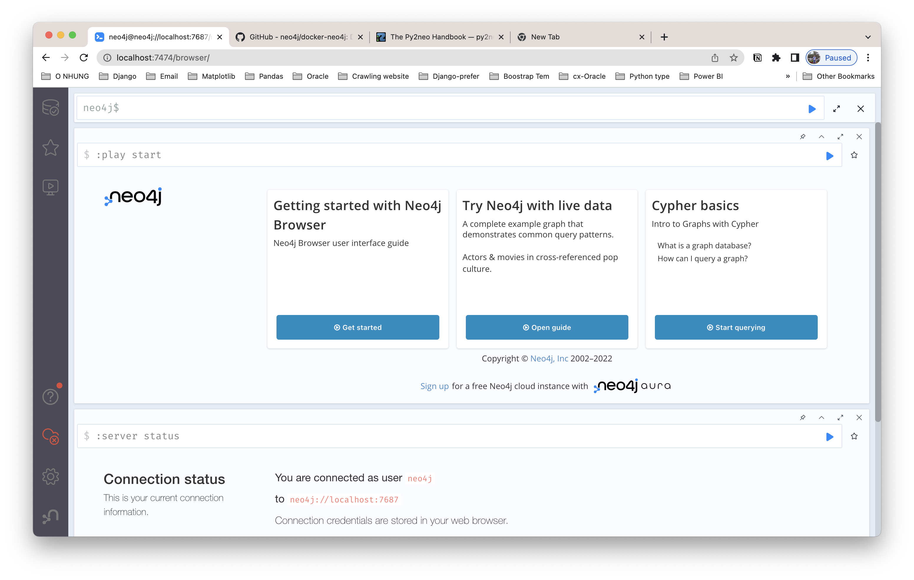

# Grap Database

## Install by docker

Get the official image on:

[Neo4j - Official Image | Docker Hub](https://hub.docker.com/_/neo4j)

Read more information about docker file:

[https://github.com/neo4j/docker-neo4j](https://github.com/neo4j/docker-neo4j)

How to run the docker images, assume that you have the installed docker on your MAC.

Run the image neo4j with the user_name = ‘neo4j’ and password = ‘test’

```bash
docker run \
    --name test2neo4j \
    -p7474:7474 -p7687:7687 \
    -d \
    -v $HOME/neo4j/data:/data \
    -v $HOME/neo4j/logs:/logs \
    -v $HOME/neo4j/import:/var/lib/neo4j/import \
    -v $HOME/neo4j/plugins:/plugins \
    --env NEO4J_AUTH=neo4j/test \
    neo4j:latest
```

Go to the [http://localhost:7474](http://localhost:7474/browser/) . 



## Connection

I use the python3 to connect to neo4j with py2neo library.

About the document handbook pls check it out.

[The Py2neo Handbook - py2neo 2021.1](https://py2neo.org/2021.1/)

Quick code to connect:

```python
import py2neo
from py2neo import Graph, Node, Relationship
user_name = 'neo4j'
password = 'test'

# Authenticate the user using py2neo.authentication
graph = Graph("bolt://localhost:7687/db/data/", auth=(user_name, password))

# method run to execute the sql
graph.run("UNWIND range(1, 3) AS n RETURN n, n * n as n_sq")

#Define nodes
c1 = Node("CUSTOMER", name="Bradley Russo",
 address="486, 6221 Et St.,Barnstaple",
 country="Ukraine", zipcode="10903")

c2 = Node("CUSTOMER", name="Jarrod Nieves",
 address="198-550 At, Rd.,Hines Creek",
 country="Greece", zipcode="10903")

c3 = Node("CUSTOMER", name="Ivor Merritt",
 address="527-9960 Vel Street,Lauw",
 country="Peru", zipcode="5624")

p1 = Node("PRODUCT",title = "Motorola Moto G (3rd Generation)",
 features = ["Advanced water resistance", "13 MP camera",
 "5in HD display", "Quad core processing power",
 "5MP rear camera", "4G LTE Speed"],
 Color ="Black", Size = "16GB",
 Dimensions = "0.2 x 2.9 x 5.6 inches",
  Weight = "5.4 ounces",price = 219.99)
p2=Node("PRODUCT",title = "Canon EOS Rebel T5",
 features = ["18 megapixel CMOS (APS-C) sensor","EF-S 18-55mm IS II standard zoom lens", "3-inch LCD TFT color,liquid-crystal monitor", "EOS 1080p full HD movie mode"],
 Color = "Black", MaximumAperture = "f3.5",
 Dimensions = "3.94 x 3.07 x 5.12 inches",
 Weight = "1.06 pounds", price = 399)
#Define relationships
r1 = Relationship(c1,"ORDERS",p1,date="2015-11-03", quantity="2")
r2 = Relationship(c2,"ORDERS",p1,date="2015-11-03", quantity="1")
r3 = Relationship(c1,"ORDERS",p2,date="2015-11-03", quantity="1")
r4 = Relationship(c2,"ORDERS",p2,date="2015-11-03", quantity="1")
r5 = Relationship(c1,"RATES",p1,rating="4.8")
r6 = Relationship(c2,"RATES",p2,quantity="4.5")

#Create nodes or entity customer
result = graph.create(c1)
result = graph.create(c2)
result = graph.create(c3)
# Create the node and entity product
result = graph.create(p1)
result = graph.create(p2)
# Create the Relationship
graph.create(r1)
graph.create(r2)
graph.create(r3)
graph.create(r4)
graph.create(r5)
```