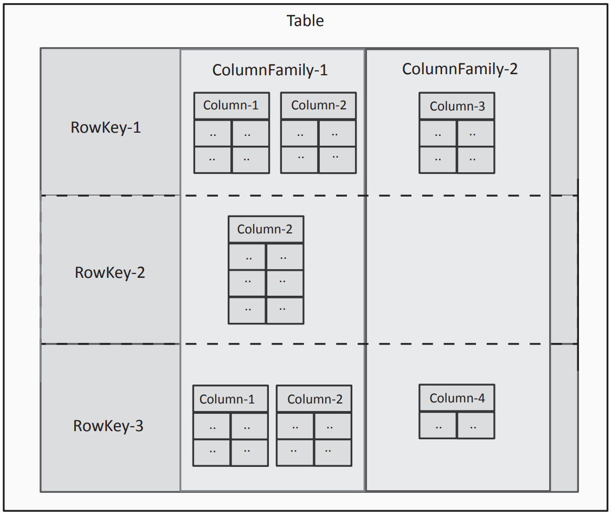

# No-SQL

# 1. Key-Value Databases

These databases store data in the form of key-value pairs

Most key-value databases have distributed architectures comprising of multiple storage nodes. The data is partitioned across the storage nodes by the keys

Được store dạng key-value, data được partition bởi key qua các hash function.

## 1.1 Amazon DynamoDB

Amazon DynamoDB is a fully-managed, scalable, high-performance NoSQL database
service from Amazon. DynamoDB provides fast and predictable performance and seamless
scalability without any operational overhead. DynamoDB is an excellent choice for a serving
database for data analytics applications as it allows storing and retrieving any amount of data
and the ability to scale up or down the provisioned throughput depending on the application’s
performance requirements. DynamoDB is a highly available and reliable service. The data
stored in DynamoDB is replicated across multiple availability zones.

Với DynamoDB thì việc xác định schema là không cần, do ko cố định. chỉ cần xác định key

mỗi key là một unique value được combine:

- Partition Key
- Sort Key

Tương tự như kafka partition và kafka offset.

# 2. Document Databases

Document store databases store semi-structured data in the form of documents which are encoded in different standards such as JSON, XML, BSON or YAML. By semi-structured data we mean that the documents stored are similar to each other (similar fields, keys or attributes) but there are no strict requirements for a schema. Documents are organized in different ways in different document database such in the form of collections, buckets or tags.

Là nột dạng No-SQL chứa key, và value là những dạng semni tructure json, XML... do vậy đặc điểm của nó là các value thường có dạng tương đồng, cùng cấu trúc.

Vậy nên thường được dùng cho website, ecommerce.

### 2.1 Mongo DB

MongoDB is a document-oriented non-relational database system. MongoDB is powerful, flexible and highly scalable database designed for web applications and is a good choice for a serving database for data analytics applications. The basic unit of data stored by MongoDB is a document

Page 135 for python code to work with Mongo DB

# 3. Column Family Databases

## 3.1 Hbase

Hbase cũng là một dạng tiêu biểu của CFD.

Cũng dạng key-value và mỗi value là từng col với từng tính chất và meta data khác nhau.

### Architecture

Hbase built on top of hadoop và cũng sẽ chạy trên dạng master shales

Đọc thêm tại page 141

### Operation

Hbase cung cấp các toán tử:

Get: Retrieve the value base on the key

Scan: Retrive the range value

PUT: Put operation is used to add a new entry, add thêm 1 value mới

Delete: mặc định thì Hbase không thể delete được record, giải pháp là build ra 1 bảng meta data ở lớp giữa có nhiệm vụ là đánh dấu những record bị xóa gọi là **[Tombstone marker](http://hadoop-hbase.blogspot.com/2011/12/deletion-in-hbase.html#:~:text=HBase%20periodically%20removes%20deleted%20cells,to%20look%20at%20all%20cells.)**. 

Một dạng “select * from table where id is not in(select id from Tombstone_table)” 

# 4. Graph Databases

Graph stores are NoSQL databases designed for storing data that has graph structure with nodes and edges. While relational databases model data in the form of rows and columns, the graph databases model data in the form of nodes and relationships. Nodes represent the entities in the data model. Nodes have a set of attributes. A node can represent different types of entities, for example, a person, place (such as a city, restaurant or a building) or an object (such as a car). The relationships between the entities are represented in the form of links between the nodes. Links also have a set of attributes. Links can be directed or undirected. Directed links denote that the relationship is unidirectional. For example, for two entities author and book, a unidirectional relationship called ‘writes’ exists between them, such that an author writes a book. Whereas for two friends, say A and B, the friendship relationship between A and B is bidirectional. In the graph theory terminology, the vertices in a graph are the nodes representing the entities and the edges between the vertices are the links between the nodes representing the relationships between the entities. A set of nodes along with the links between them form a path.

Khác với 3 loại trên, vẫn là dạng gôc là key-value. Graph có 2 thành phần chính là node là relationship.

Mỗi node là một entity một thực thể một object

Các node liên kết với nhau bởi relationship.

Ví dụ: Books and Authors

- Books và Authors là entity trong Book có: title, date, type...Trong Authors có: name, DOB,...
- Books có relationship với Authors là **write**

Graph databases are useful for a wide range of applications, where you may need to model entities and the relationships between them, such as social media, financial, networking or various types of enterprise applications. In relational databases, the relationships between entities are modeled in the form on different tables with primary keys and foreign keys. The steps involved in mapping an entity-relationship diagram into relational tables are described in Chapter-10. Computing relationships and querying related entities in relational databases require complex join operations between the database tables. Graph databases, in contrast to relational databases, model relationships in the form of links between the nodes. Since the relationships between the entities are explicitly stored in the form of links, querying for related entities in graph databases is much simpler and faster than relational databases as the complex join operations are avoided. Graph databases are suitable for applications in which the primary focus is on querying for relationships between entities and analyzing the relationships.

### 4.1 Neo4j

Neo4j là một dạng Graph database. Các giới thiệu về cài đặt connect to Neo4j by Python. Pages 147-152

# Summary

Non-relational databases or NoSQL databases are popular for applications in which the scale of data involved is massive and the data may not be structured. Furthermore, real-time performance is considered more important than consistency. In this chapter we described four types of NoSQL databases. Figure 4.14 provides a comparison of these four types of NoSQL databases. The key-value databases store data in the form of key-value pairs where the keys are used to identify uniquely the values stored. Hash functions are applied to the key to determine where the value should be stored. Document store databases store semi-structured data in the form of documents which are encoded in different standards such as JSON, XML, BSON or YAML. The benefit of using document databases over key-value databases is that these databases allow efficiently querying the documents based on the attribute values in the documents. Column family databases store data as columns where a column has a name and a value. Columns are grouped into column families and a collection of columns make up a row which is identified by a row-key. Column family databases support high-throughput reads and writes and have distributed and highly available architectures. Graph databases model data in the form of nodes and relationships. Nodes represent the entities in the data model and have a set of attributes. The relationships between the entities are represented in the form of links between the nodes.

